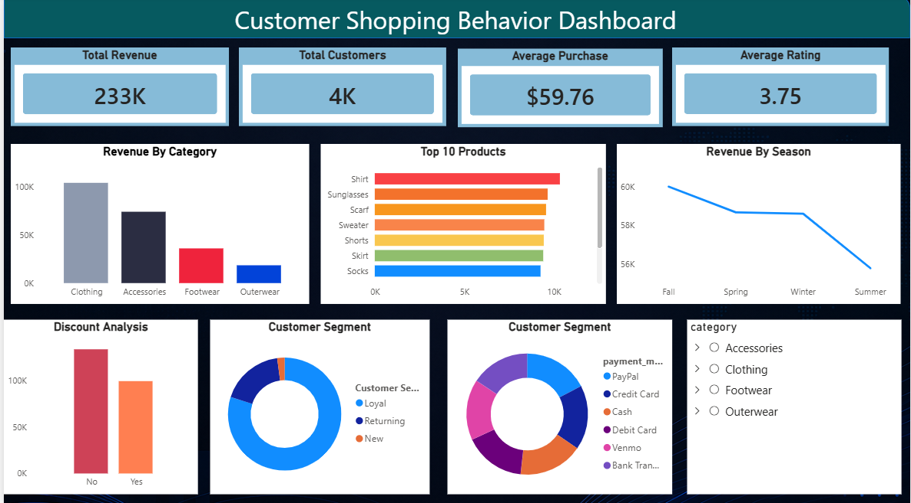

# 🛍️ Customer Shopping Behavior Analysis & Dashboard

An end-to-end data analysis project that cleans raw retail transaction data, explores it using SQL, and visualizes it through an interactive Power BI dashboard — to understand **who shops, what they buy, and what drives revenue**.



---

## 📌 Project Overview

This project analyzes **3,900 customer shopping transactions**, covering demographics, product categories, payment behavior, discounts, subscriptions, and purchase history. The goal is to answer real retail business questions — like which categories drive revenue, whether discounts actually help, and which customers are most loyal — and present them in a clean, interactive dashboard.

**Workflow:**
```
Raw CSV → Python (clean & engineer features) → MySQL (load + query) → Power BI (visualize)
```

---

## 🗂️ Project Structure

| File | Purpose |
|---|---|
| `customer_shopping_behavior.csv` | Raw dataset (3,900 rows, 18 columns) |
| `Customer_Shopping_Behaviour_Analysis.ipynb` | Python notebook — data cleaning, feature engineering, loads data into MySQL |
| `customer_shopping_behavior.sql` | SQL queries answering 10 key business questions |
| `Customer_Shopping_Behavior_Dashboard.pbix` | Power BI dashboard file |
| `Customer_Behavior_Analysis.png` | Dashboard screenshot |

---

## 🧹 Data Cleaning & Feature Engineering (Python)

Done in the Jupyter notebook using `pandas` + `SQLAlchemy`:

- Loaded the CSV into a **MySQL** database for structured querying.
- Filled missing `Review Rating` values using the **median rating per category** (keeps category-level rating patterns intact instead of using one global average).
- Standardized column names (lowercase, underscores).
- Created an **Age Group** feature — Young Adult (18–31), Adult (32–44), Middle-aged (45–57), Senior (58–70) — using quartile-based binning.
- Converted text-based purchase frequency (`Weekly`, `Monthly`, etc.) into a numeric **Purchase Frequency (Days)** column for trend analysis.
- Detected that `promo_code_used` was an exact duplicate of `discount_applied` and dropped it.

---

## 🧮 Business Questions Answered (SQL)

The `.sql` file answers 10 questions directly against the MySQL table, including:

1. Total revenue: male vs. female customers
2. Customers who used a discount but still spent above average
3. Top 5 products by average review rating
4. Standard vs. Express shipping — average spend comparison
5. Subscribers vs. non-subscribers — spend and revenue comparison
6. Top 5 products most often sold at a discount
7. Customer segmentation: New / Returning / Loyal (by purchase history)
8. Top 3 best-selling products within each category
9. Repeat buyers (5+ purchases) — how many are subscribers?
10. Revenue contribution by age group

---

## 📊 Dashboard (Power BI)

**KPIs:** Total Revenue · Total Customers · Average Purchase Amount · Average Review Rating

**Visuals:**
- Revenue by Category (column chart)
- Top 10 Products by revenue (bar chart)
- Revenue by Season (line chart)
- Discount Applied vs. Not — revenue comparison
- Customer Segment breakdown (donut)
- Payment Method distribution (donut)
- Category filter/slicer for interactive drill-down

---

## 💡 Key Insights

| Metric | Value |
|---|---|
| Total Revenue | **$233,081** |
| Total Customers | **3,900** |
| Avg. Purchase Amount | **$59.76** |
| Avg. Review Rating | **3.75 / 5** |

- **Clothing** is the top revenue-generating category ($104,264, ~45% of total), followed by Accessories, Footwear, and Outerwear.
- **Male customers** generated ~2x the revenue of female customers ($157,890 vs $75,191) — driven mainly by a ~2:1 male-to-female customer ratio in the data, not higher per-customer spend.
- **Blouse, Pants, and Jewelry** are the most frequently purchased items (171 orders each).
- **Non-discounted purchases** account for more total revenue ($133,670) than discounted ones ($99,411) — and 839 customers used a discount while still spending above average, showing discounts aren't only reaching low-spend, price-sensitive shoppers.
- **Subscribers spend about the same per order as non-subscribers** ($59.49 vs $59.87) — subscription status alone doesn't strongly predict spend.
- **Loyal customers dominate the base**: 3,116 Loyal vs. 701 Returning vs. only 83 New — this customer base is heavily retention-driven rather than new-acquisition-driven.
- **Revenue is fairly flat across seasons** (Fall highest at $60,018, Summer lowest at $55,777) — no major seasonal spike.

---

## 🛠️ Tech Stack

- **Python** — pandas, SQLAlchemy
- **Database** — MySQL
- **Visualization** — Power BI

---

## ▶️ How to Reproduce

1. Clone this repo and set up a local MySQL server.
2. Update the MySQL connection string in the notebook (`create_engine(...)`) with your own credentials.
3. Run `Customer_Shopping_Behaviour_Analysis.ipynb` to clean the data and load it into MySQL.
4. Run the queries in `customer_shopping_behavior.sql` to explore the business questions.
5. Open `Customer_Shopping_Behavior_Dashboard.pbix` in Power BI Desktop to view/edit the dashboard.

---

## 📎 Dataset

Customer shopping transaction data with demographics, purchase details, payment method, discounts, and purchase history (18 columns, 3,900 records).
